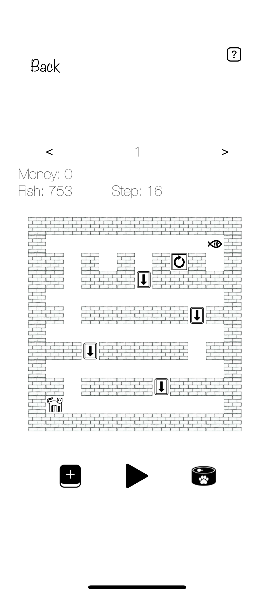

This is a little cat that is lost\n in a maze and doesn't know the way.

You can reward it by feeding it to help it\n gradually learn the way in the maze.

Three Mode Introduction

Focus: When you're ready to concentrate on studying, working, or preparing to sleep, set a timer and let the little cat accompany you on a journey. When the time is up, you will receive coins! (The number of coins depends on how many times the cat reaches the finish line.)

Feed: You can use coins to buy little fish that the cat loves to eat. Click the 'cat food' icon to feed the cat! Choosing the right time to feed it can help the cat remember the correct direction to move in.

Fame: Try to help your cat break records on the map. If it makes it to the leaderboard, you can receive extra coins every day.

Aside from buying cat food, you can also\n use coins to unlock more maps.

Try to earn more coins and unlock more maps!

Getting Support:

E-mail:  hankerlu1996@gmail.com